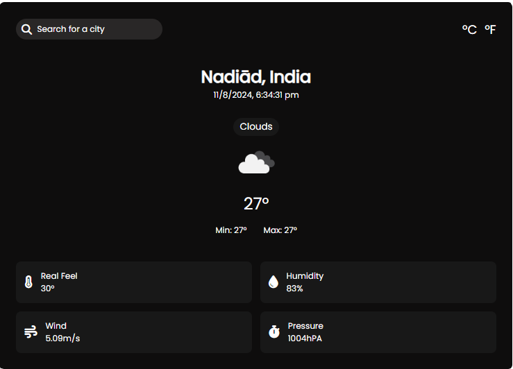

# Weather App

## Description
This project is a web application that fetches weather data from a weather API based on the user's location or a user-inputted location. The application displays the current weather conditions, temperature, and other relevant information such as humidity, wind speed, and weather descriptions. 

The layout includes:
- **Blue Gradient Square**: A visually appealing design element.
- **Circle with Gradient**: Another design element to enhance the user interface.

## Features
- Fetches weather data using a public weather API.
- Displays current weather conditions.
- Option to search for weather by the user’s location or a manually entered location.
- Visually appealing design using gradient elements.

## Technologies Used
- **HTML**: Structure of the web page.
- **CSS**: Styling and layout, including gradient designs.
- **JavaScript**: Logic for fetching data from the weather API and updating the DOM with the weather information.
- **API**: Integrating with a weather API to fetch real-time weather data.

## Screenshot

